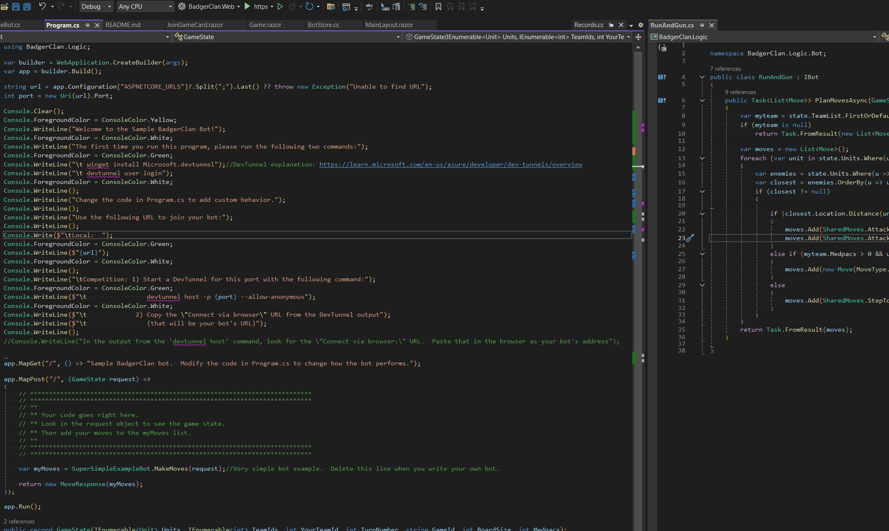

# BadgerClan
A simple game of hexagonal tiles.

> Note: This requires that you have the [.NET 9 SDK](https://dotnet.microsoft.com/en-us/download/dotnet/9.0) installed on your machine.

## Getting Started (using Visual Studio)
1. Clone the repository.
1. Open the BadgerClan.sln file to load the solution.
1. Select the "Client and Server" startup project  
    
1. Press F5 to run the game (or click the solid green "Start" button).
1. A web browser will open to the BadgerClan lobby.  Type in a name for your game and click the "Create New Game" button.
1. You will also see a new terminal open (it may be minimized, check your taskbar). It should say something like "Welcome to the Sample BadgerClan Bot!"
1. Go to "Running the game" below.

## Getting Started (using Visual Studio Code)
1. Clone the repository
1. Open the directory in VS Code
1. In one terminal window, cd into the BadgerClan.Web directory (`cd BadgerClan.Web`) and then run `dotnet run`
1. Open a browser to http://localhost:5172 Type in a name for your game and click the "Create New Game" button.
1. In another terminal window, cd into the BadgerClan.Client directory (`cd BadgerClan.Client`) and run `dotnet run`
1. Go to "Running the game" below.

## Running the game
1. Copy the http://localhost address from the Client terminal window, and paste it into the "Custom" box back in the browser.  Click the "Join Game" button.
1. Now add a few of the other types of bots by selecting the bot type (e.g. Run & Gun) and clicking "Join Game"
1. Once you have at least two bots joined in the game you can click the "Start Game" button.
1. Notice that the terminal window with your Sample BadgerClan Bot is starting to spit out logs. That shows the server is talking to the client.  
    

## Demo - How you can run this on your machine

> Don't forget to set the startup project to "Client and Server" (not BadgerClan.Client or BadgerClan.Web)

## Customizing your bot
1. Navigate to BadgerClan.Client and open its Program.cs file
1. Look for the comment that says "Your code goes right here".
1. The `request` object gives you a list of Units with their locations.  Your units are the ones whose `Team` matches `request.YourTeamId`  
    ```csharp
    var myUnits = new List<Unit>();
    foreach(var unit in request.Units)
    {
        if(unit.Team == request.YourTeamId)
        {
            myUnits.Add(unit);
        }
    }
    ```
### Warning: Friendly Fire is On

## Further Information
Coordinate System: https://www.redblobgames.com/grids/hexagons/


## Development Work

### Game Design
- [ ] After some rounds of no units dieing, every Unit loses one hitpoint
    - [ ] Count the Rounds
- [ ] If everyone dies as the same time (stalemate) tiebreakers are
    - [ ] Team with most kills
    - [ ] Most units before final hitpoint loss
- [x] Track number of kills
- [x] Units can act if they have at least 0.1 moves remaining
- [x] Improve effectiveness of Medpacs, gameengine not giving enough medpacs

### Features
- [ ] Limit the number of players
- [ ] Ability to boot players from a game that hasn't started
- [x] Host can end the game from the game page, in cases of stalemate or false start
- [x] Timeout the calls to clients
- [ ] Limit the size of the client move list
- [x] Don't make calls to dead teams
- [X] Ability for the host to restart the game with the same players
- [X] Add a game leader board
- [x] Delete the weather and counter page
- [ ] Game Log 
- [ ] Second Leaderboard with number of kills
- [ ] Ability for host to slow down the game, make tick interval variable 


### Bugs
- [ ] If you click the join button after start, the UI is odd
- [ ] Validate the client endpoint with a request/response
- [ ] Limit the characters for name and urls
- [ ] Websocket occasionally disconnects from server
- [x] Units can be placed off the board, if there are lots of units
- [X] If there are multiple games created but not started, the radio buttons don't work right
- [X] Game does not declare the correct winner
- [x] Create game component not properly listening to game state change, specifically if another person adds a new team
- [X] Only the host should have the start game button
- [x] A bad response from the client crashes causes an exception that stops the server
- [X] Review GameEngine.ProcessTurn(), Attack does not have the same rounding benefit as Walk, is that intentional?

### Documentation
- [x] Example tutorial for moving around
- [ ] Example tutorial for determining boundaries
- [x] Example tutorial for identifying nearest enemies
- [x] Example tutorial for a sample bot

### Code Quality
- [ ] Rename Unit.Moves to ActionsRemainingThisTurn (or something similar)
- [ ] Rename AttackCount to ActionsCostPerAttack (or something similar)
